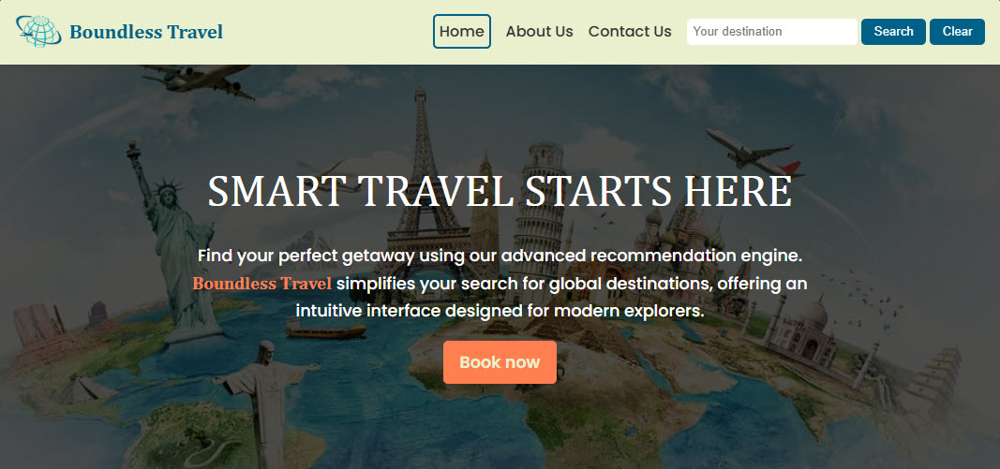
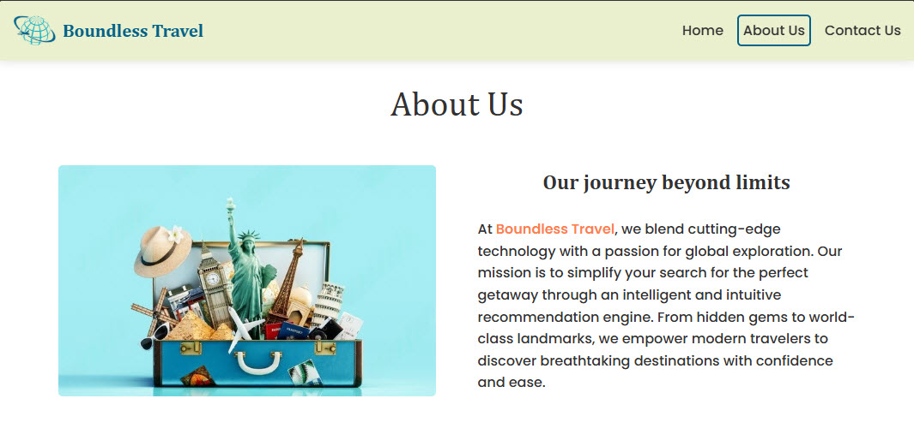
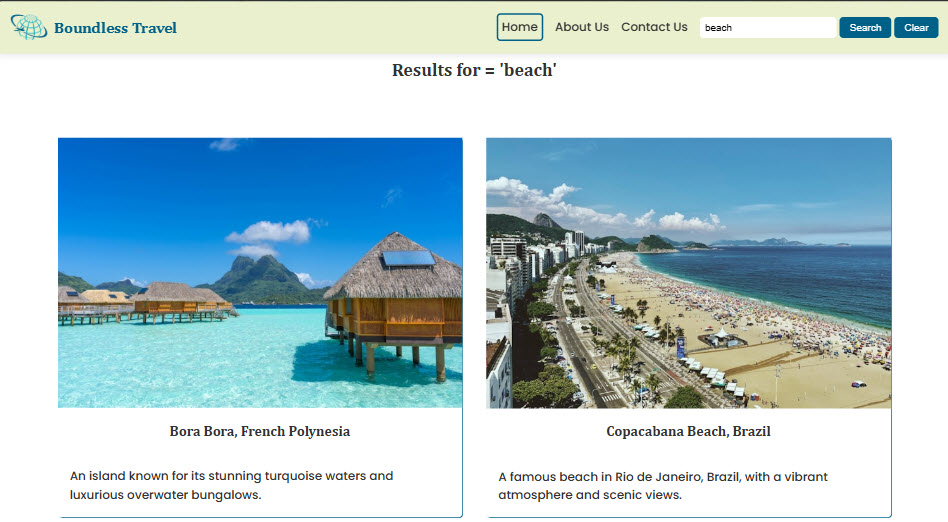
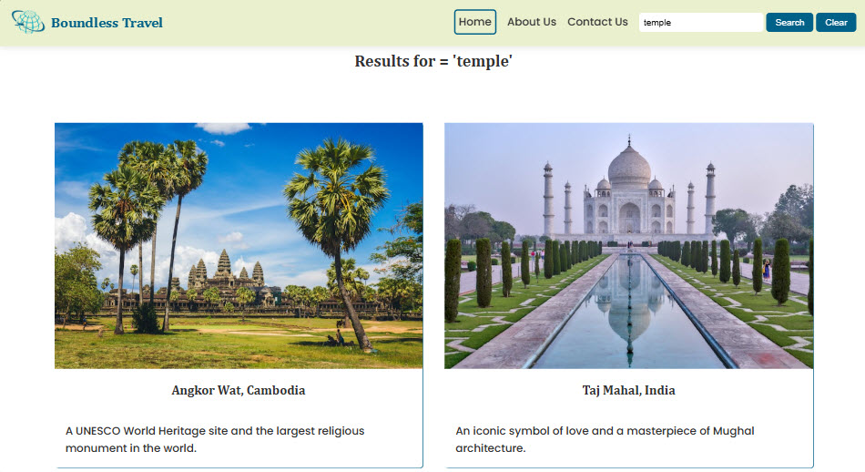

## Boundless Travel
final project for course IV / IBM JavaScript Backend Developer Specialization

visit the project here: https://ramirezjm.github.io/boundless_travel/

[](https://choosealicense.com/licenses/mit/)


- Boundless Travel is a fully functional Travel Recommendation Web Application.

<div>
  
</div>

<div>
  
</div>

- It allows you to search using keywords and provides recommendations for places.

<div>
  
</div>

<div>
  
</div>

#### Clone the repository

```bash
   git clone https://github.com/RamirezJM/boundless_travel.git
   cd boundless_travel
```

